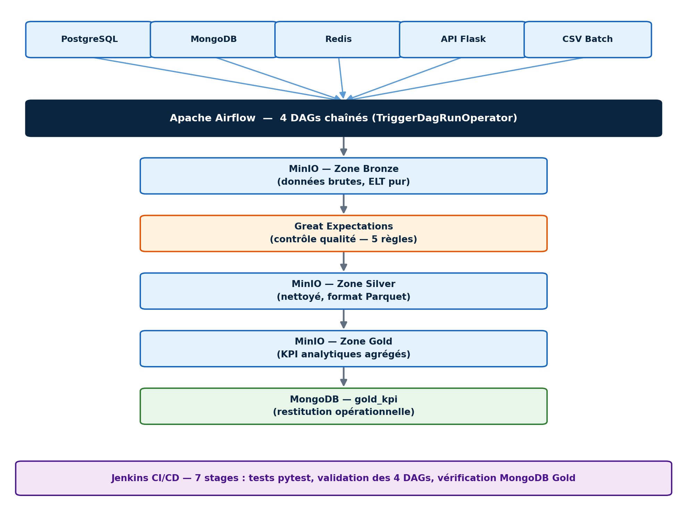

# Data Lake Multi-Sources — Olist Brazilian E-Commerce

> Architecture Medallion (Bronze/Silver/Gold) sur MinIO, orchestrée par 4 DAGs Airflow chaînés automatiquement, validée par Great Expectations et un pipeline Jenkins CI/CD exécutant de vrais tests dans l'environnement de production.


---

## Sommaire

- [Architecture](#architecture)
- [Stack technique](#stack-technique)
- [Démarrage rapide](#démarrage-rapide)
- [Structure du projet](#structure-du-projet)
- [Le pipeline en détail](#le-pipeline-en-détail)
- [Résultats](#résultats)
- [Tests](#tests)
- [Problèmes rencontrés](#problèmes-rencontrés)
- [Roadmap](#roadmap)
- [Auteur](#auteur)

---

## Architecture



5 sources hétérogènes → Airflow (4 DAGs chaînés) → MinIO Bronze → Great Expectations → MinIO Silver (Parquet) → MinIO Gold → MongoDB (restitution opérationnelle), le tout validé par un pipeline Jenkins CI/CD à 7 stages.

## Stack technique

| Composant | Rôle |
|---|---|
| **Apache Airflow 2.9.0** | Orchestration des 4 DAGs, chaînage automatique (`TriggerDagRunOperator`) |
| **MinIO** | Data Lake objet compatible S3 — zones Bronze / Silver / Gold |
| **PostgreSQL** | Metadata Airflow + source relationnelle (orders, customers, order_items) |
| **MongoDB** | Source documentaire (products, reviews) + restitution Gold opérationnelle |
| **Redis** | Source temps réel (paiements) — stockage clé-valeur |
| **Flask** | Micro-service API REST (sellers) — source externe HTTP réelle |
| **Great Expectations** | Validation de la qualité des données (5 règles) |
| **Jenkins** | CI/CD — tests, validation des DAGs, vérification MongoDB Gold |
| **Docker Compose** | Orchestration de 9 services conteneurisés |

## Démarrage rapide

```bash
git clone https://github.com/bipanda93/datalake-multi-sources.git
cd datalake-multi-sources

# 1. Télécharger le dataset Olist (voir data/README.md) et le placer dans data/

# 2. Lancer l'infrastructure (9 services)
docker-compose up -d

# 3. Airflow UI
open http://localhost:8184   # webserver + scheduler

# 4. Jenkins UI
open http://localhost:8090   # pipeline CI/CD

# 5. Déclencher le pipeline complet
# Un seul clic sur dag1_ingestion_bronze dans Airflow déclenche
# automatiquement les DAGs 2, 3 et 4 en cascade.
```

## Structure du projet

```
datalake-multi-sources/
├── dags/
│   ├── dag1_ingestion_bronze.py     # Ingestion ELT pur (5 sources → Bronze)
│   ├── dag2_quality_check.py        # Validation Great Expectations
│   ├── dag3_silver_transform.py     # Nettoyage, typage, format Parquet
│   └── dag4_gold_restitution.py     # Agrégation KPI + restitution MongoDB
├── data/                            # Dataset Olist (9 CSV, non versionné)
├── scripts/
│   ├── init_postgres.sql            # Schéma orders / customers / order_items
│   └── init_mongo.js                # Collections products / reviews
├── api_service/                     # Micro-service Flask (source sellers)
│   ├── app.py
│   ├── requirements.txt
│   └── Dockerfile
├── tests/
│   └── test_pipeline.py             # 10 tests pytest
├── logs/                            # Logs Airflow (volume monté)
├── docker-compose.yml               # 9 services
├── requirements.txt                 # Dépendances Python (container Airflow)
└── Jenkinsfile                      # Pipeline CI/CD, 7 stages
```

## Le pipeline en détail

1. **DAG 1 — Ingestion Bronze** : copie brute des 5 sources (PostgreSQL, MongoDB, Redis, API Flask, CSV batch) vers MinIO, zéro transformation (ELT strict). Idempotent (TRUNCATE / delete_many / flushdb avant chaque run).
2. **DAG 2 — Contrôle Qualité** : 5 règles Great Expectations (non-null, unicité, valeurs positives). Bloque la chaîne si une règle échoue.
3. **DAG 3 — Transformation Silver** : nettoyage, typage, déduplication (dont un dédoublonnage massif par agrégation sur la géolocalisation), écriture en Parquet.
4. **DAG 4 — Agrégation Gold** : 6 KPI calculés (CA, panier moyen, top produits, satisfaction, délai de livraison, top vendeurs), consolidés via XComs et restitués dans MongoDB.

Le chaînage entre les 4 DAGs est **entièrement automatique** (pattern Push via `TriggerDagRunOperator`) — un déclenchement manuel unique sur DAG 1 suffit à exécuter tout le pipeline.

## Résultats

| Indicateur | Valeur |
|---|---|
| Enregistrements ingérés | 1,55 million (5 sources) |
| Commandes traitées | 99 441 |
| Chiffre d'affaires | 13 591 643,70 BRL |
| Tests pytest | 10/10 PASSED (container Airflow réel) |
| Pipeline Jenkins | 7/7 stages, ~16 secondes |
| Idempotence | Validée sur 2 exécutions complètes |

## Tests

```bash
docker exec datalake_airflow bash -c "python3 -m pytest /opt/airflow/tests/test_pipeline.py -v"
```

10 tests couvrant : validation fichier, règles Great Expectations, calcul des KPI, structure des DAGs.

## Problèmes rencontrés

6 bugs diagnostiqués et résolus à partir de logs réels (hostname MinIO invalide, timeout webserver Gunicorn, création utilisateur admin Airflow, installation YAML multi-lignes, bruit healthcheck PostgreSQL, Docker absent de Jenkins) — plus le bug NoSuchKey qui a motivé la conception du chaînage automatique entre DAGs. Détail complet dans le rapport de projet.

## Roadmap

- [ ] Migrer le chaînage Push vers le pattern **Datasets** (Airflow 2.4+) pour un découplage total
- [ ] Ajouter Prometheus + Grafana pour le monitoring
- [ ] CeleryExecutor / KubernetesExecutor pour la parallélisation multi-machine

## Auteur

**Franck Ulrich Bipanda** — Mastère Data Engineering, Digital School de Paris
[Portfolio](https://datascienceportfol.io/bipandaf) · [GitHub](https://github.com/bipanda93)

## Licence

MIT — voir [LICENSE](LICENSE)
